# 🐱 En equipo: Git + GitHub

Haciendo la continuación del [versionado con Git](./git-versioning.mdx), cerraremos el ciclo de trabajo en equipo con GitHub.

## Haciendo nuestros cambios

1. Creamos una rama nueva para realizar cambios
2. Modificamos/agregamos/eliminamos
3. Agregamos a stage los cambios (a partir de acá, usamos VSCode para ciertas acciones)
4. Hacemos un commit con un mensaje descriptivo

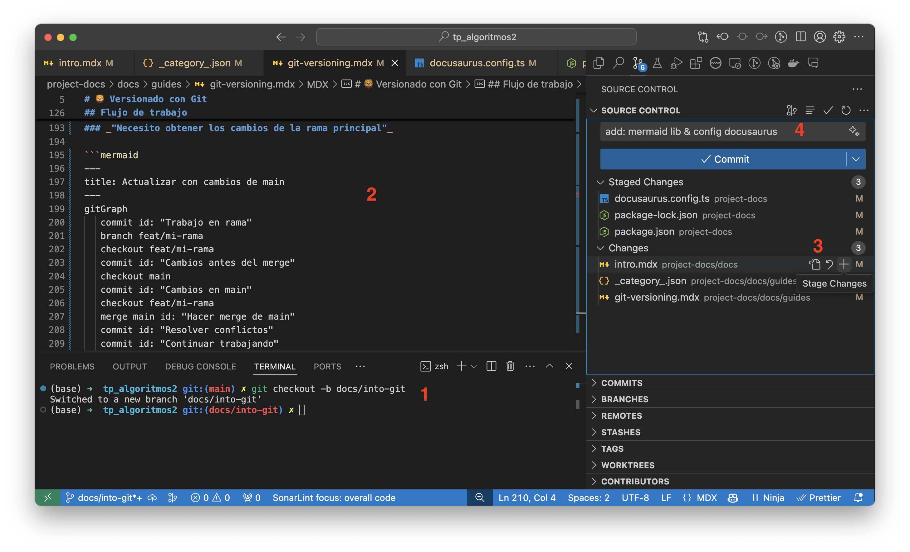

## Subimos nuestros cambios al repositorio remoto

5. Agregamos todos los commits necesarios y sincronizamos los cambios en _Sync Changes_. Con esto hacemos un push a la rama que estamos trabajando pero en GitHub.

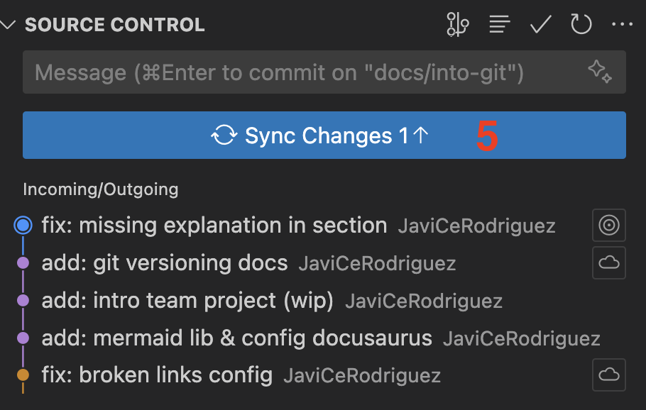

## Creando un Pull Request

6. Vamos al [repositorio](https://github.com/JaviCeRodriguez/tp_algoritmos2) y entramos a la pestaña _Pull requests_
7. Creamos el PR desde el botón _New pull request_

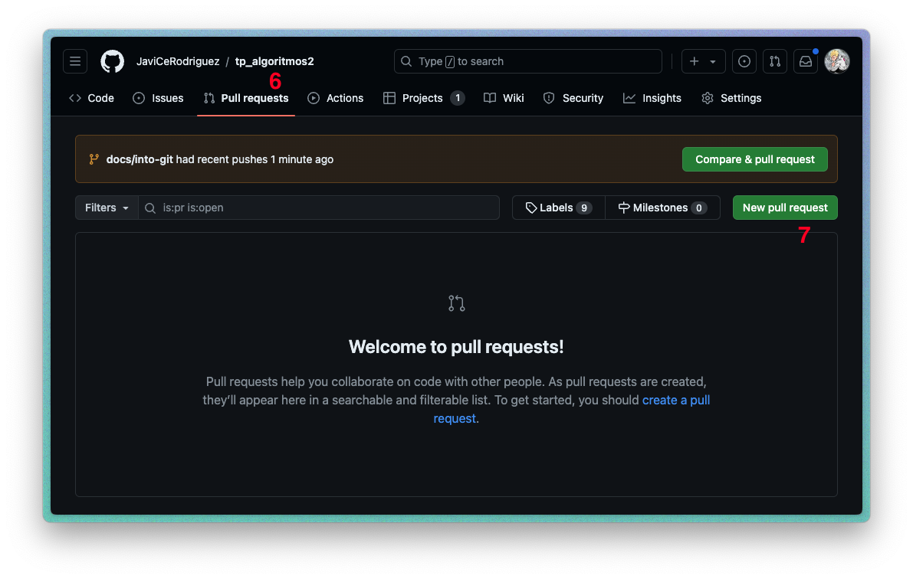

## Seleccionamos la rama para el PR

8. Seleccionamos la rama que queremos mergear (source) y la rama a la que queremos mergear (target)
9. Veremos un listado de los commits hechos,
10. y los archivos que se modificaron, agregaron o eliminaron.
11. Creamos el PR desde el botón _Create pull request_

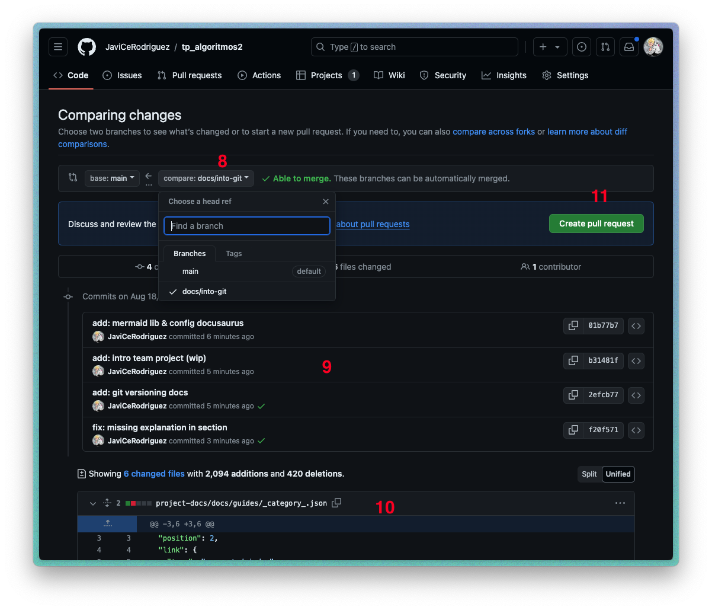

## Llenamos el formulario del PR

12. Llenamos el formulario con un título y una descripción de los cambios que hicimos
13. Asignamos un revisor desde la sección _Reviewers_ (puede ser cualquiera menos el autor del PR)
14. Asignamos el autor del PR desde la sección _Assignees_
15. Creamos el PR desde el botón _Create pull request_
16. Hay otras opciones en el PR que podemos completar, pero lo que mencionamos es lo básico para crear un PR

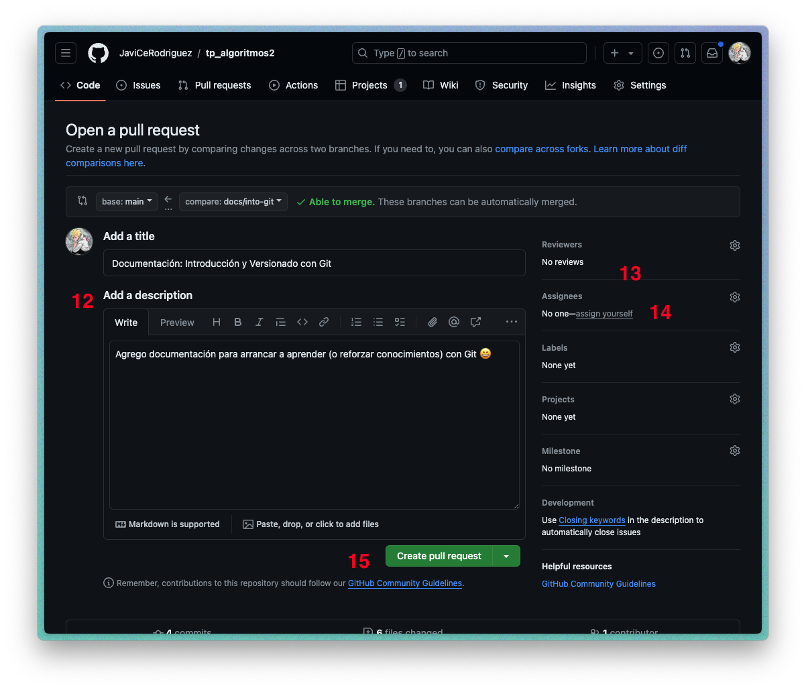

## Revisión del PR: `Conversation`

17. Vemos la información que completamos en el PR previamente
18. También el listado de commits y otras acciones registradas en la rama
19. En este caso, vemos un bot de _Vercel_ que nos dice que se desplegó la rama para tener una vista previa (es para la documentación de este proyecto).
Pueden existir otros bots como _SonarCloud_ para revisar la calidad del código, _Codecov_ para revisar la cobertura de tests, entre otros.

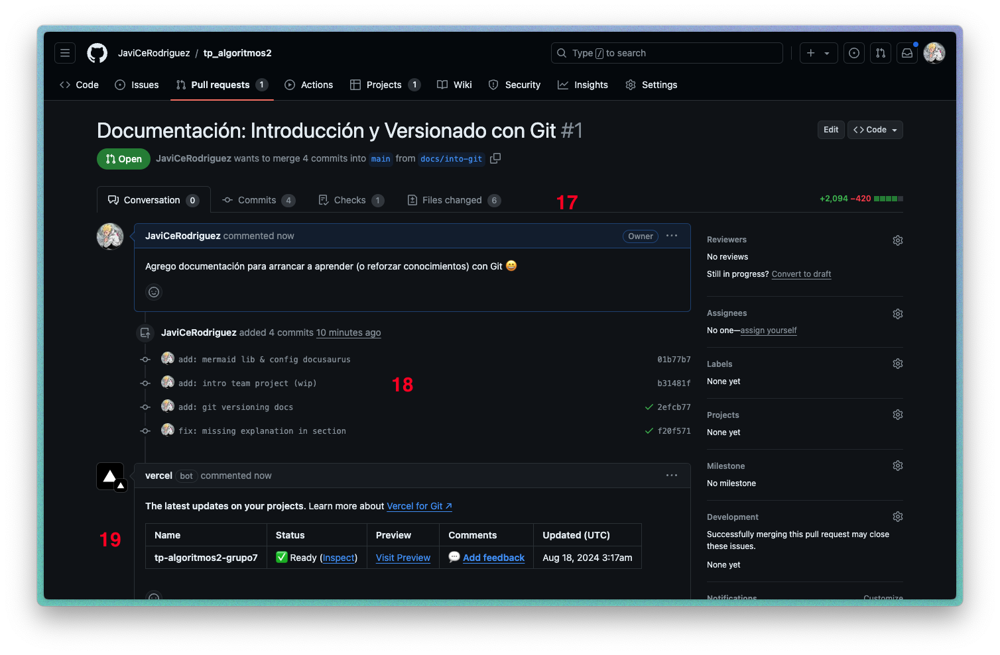

## Revisión del PR: `Files changed`

20. Vemos los archivos que se modificaron, agregaron o eliminaron con su diff correspondiente
21. Podemos marcar como revisado chequeando la opción de _Viewed_ en cada archivo
22. Desde el botón _Review changes_ podemos agregar comentarios en línea, revisar los cambios y aprobar o rechazar el PR. Finalizamos la revisión con el botón _Submit review_

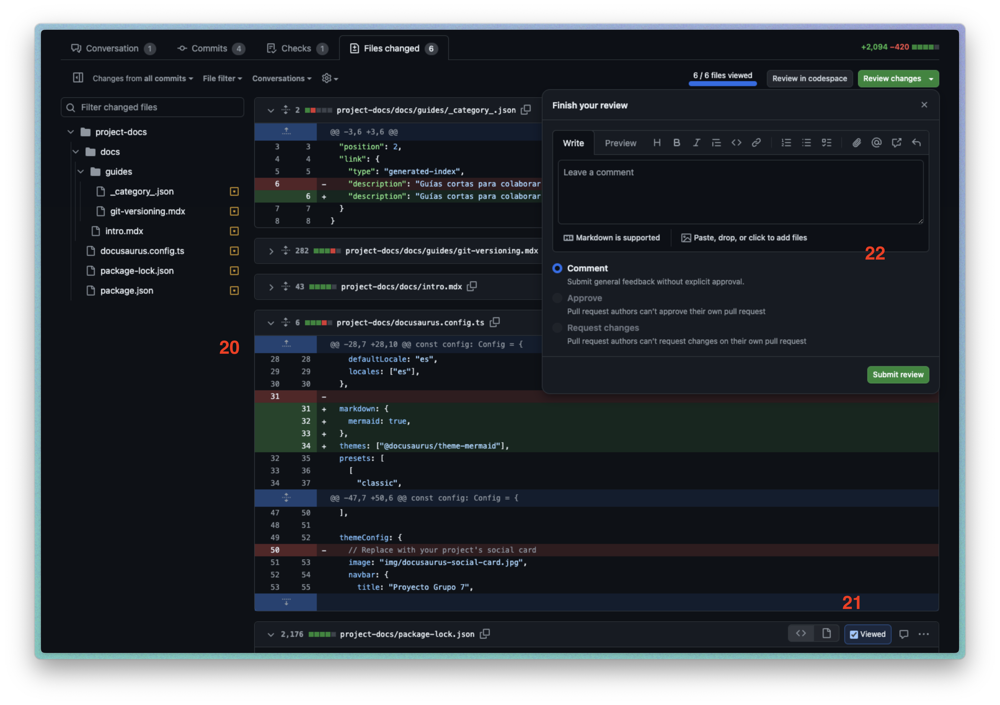

## Opciones para mergear

23. Una vez que se revisó el PR, podemos mergearlo desde el botón _Merge pull request_. Antes podemos verificar si hay conflictos, si se puede mergear o si hay problemas con los checks de calidad.

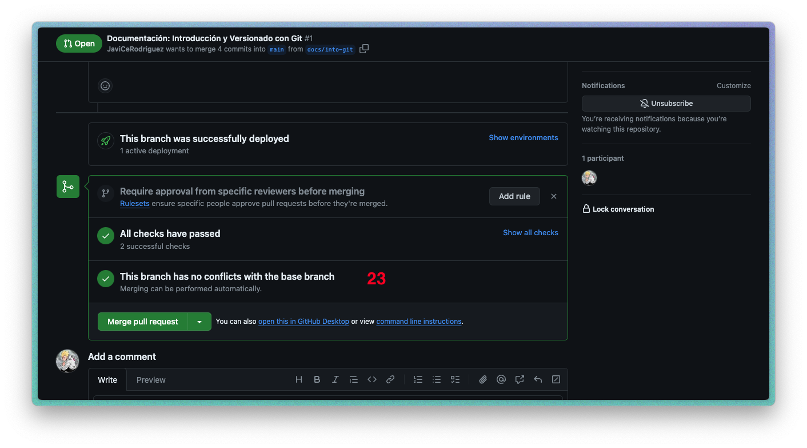

:::tip Opciones de merge

- **Merge pull request**: Crea un commit de merge con los cambios de la rama source y la rama target
- **Squash and merge**: Combina todos los commits de la rama source en un solo commit en la rama target
- **Rebase and merge**: Reescribe la historia de la rama source en la rama target

Nosotros usaremos _**Merge pull request**_ para este y los siguientes Pull Requests. No cambiemos esta opción porque puede generar problemas en la historia de git del proyecto.
:::

## Confirmación del merge

24. Confirmamos el merge desde el botón _Confirm merge_. Esto cerrará el PR y los cambios se verán reflejados en la rama target.

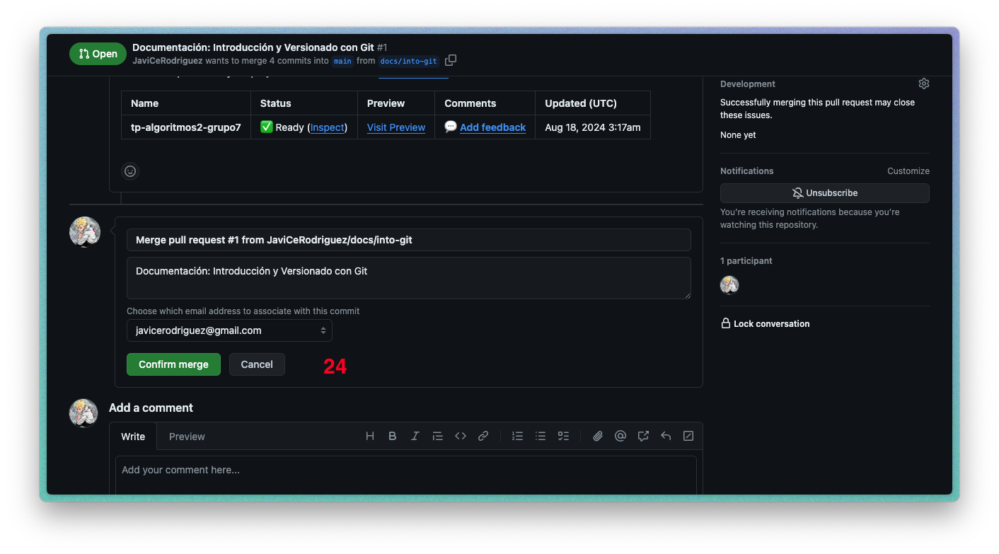

## Cambios mergeados

25. Una vez que se mergeó el PR, podemos ver los cambios en la rama target y un mensaje de confirmación del merge.
26. Podemos eliminar la rama source una vez que se mergeó el PR desde el botón _Delete branch_. Esto es opcional, pero es recomendable para mantener el repositorio limpio.

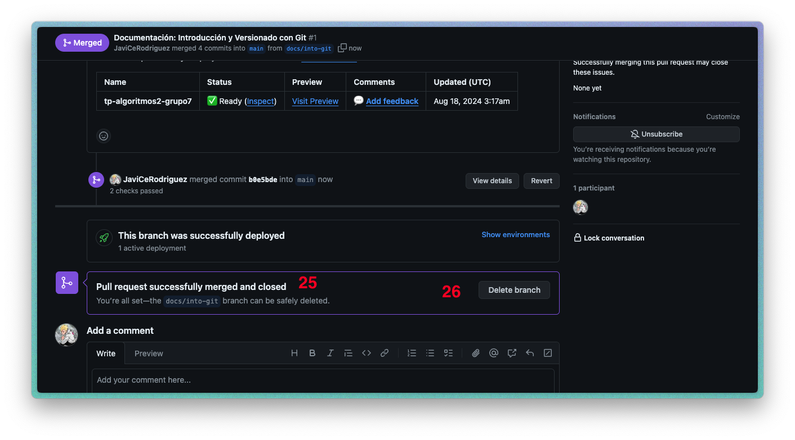

## Nos traemos los cambios a nuestra rama `main` local

27. Finalizamos el ciclo de trabajo sincronizando los cambios en nuestra rama `main` local. Para ello, hacemos un pull desde la rama `main` remota a nuestra rama `main` local.

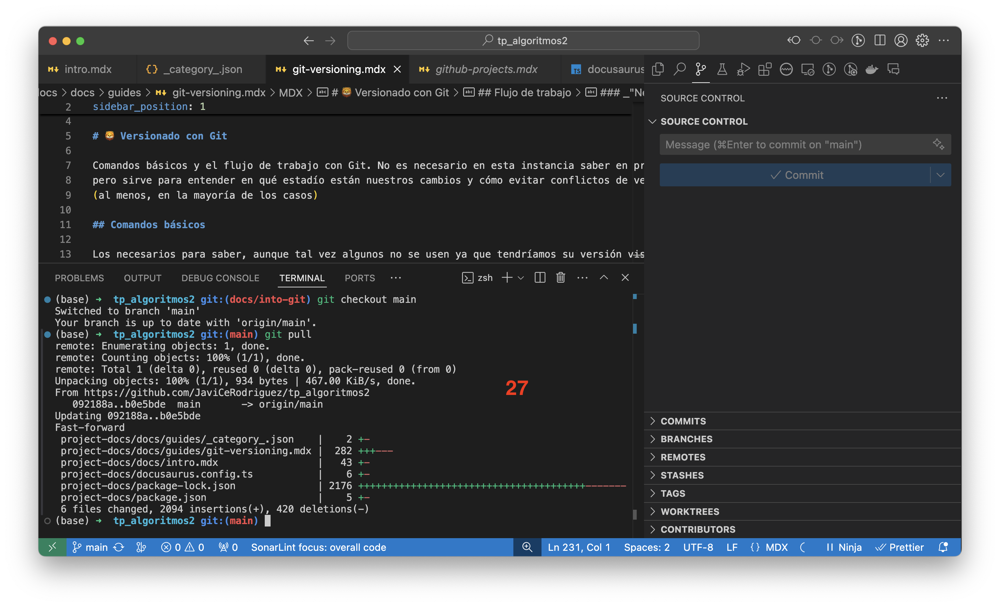

Y listo! Hemos cerrado el ciclo de trabajo en equipo con Git y GitHub. Ahora podemos seguir trabajando en nuevas funcionalidades, correcciones de errores, refactorizaciones, lo que sea.