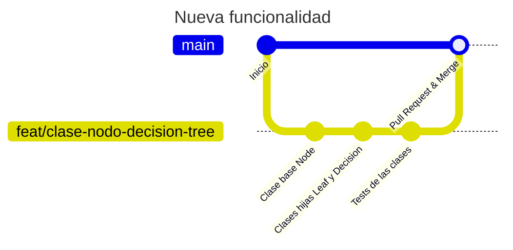
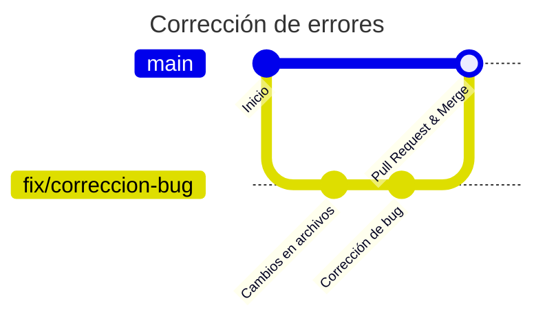
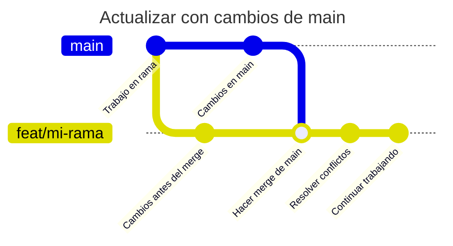

# 🦁 Versionado con Git

Comandos básicos y el flujo de trabajo con Git. No es necesario en esta instancia saber en profunidad como funciona Git,
pero sirve para entender en qué estadío están nuestros cambios y cómo evitar conflictos de versiones
(al menos, en la mayoría de los casos) 

## Comandos básicos

### Clonar un repositorio

Es la acción de copiar un repositorio remoto a tu máquina local. Para ello, se utiliza el comando `git clone` seguido de la URL del repositorio.
Esto creará una carpeta con el nombre del repositorio en la ubicación donde se ejecute el comando.

```bash
>> git clone https://github.com/JaviCeRodriguez/tp_algoritmos2.git
```

### Ver el estado de los archivos

Para ver el estado de los archivos, se utiliza el comando `git status`. Este comando muestra los archivos que han sido modificados, agregados o eliminados.

```bash
>> git status
```

Si usamos un IDE como **Visual Studio Code**, estos cambios se pueden ver en el panel derecho como "**Source Control**".

### Agregar archivos al stage

Para agregar archivos al stage, se utiliza el comando `git add` seguido del nombre del archivo o la carpeta. Si se quiere agregar todos los archivos, se puede utilizar el punto `.`.

```bash
>> git add .
```

### Hacer un commit

Para hacer un commit, se utiliza el comando `git commit -m` seguido de un mensaje que describa los cambios realizados.

```bash
>> git commit -m "feat: Agrego la documentación de Git Versioning"
```

:::tip Qué onda con el `feat:`?

En un ambiente profesional (por lo general), se utilizan prefijos en los mensajes de commit para identificar el tipo de cambio que se realizó. Algunos ejemplos son:

- `feat`: Nueva funcionalidad
- `fix`: Corrección de errores
- `docs`: Cambios en la documentación
- `style`: Cambios en el estilo del código
- `refactor`: Refactorización del código
- `test`: Agregar o modificar pruebas
- `chore`: Tareas de mantenimiento

Seguido de los dos puntos `:`, se escribe un mensaje breve que describa el cambio realizado.

:::

### Subir cambios al repositorio remoto

Para subir los cambios al repositorio remoto, se utiliza el comando `git push` seguido del nombre del repositorio y la rama.

```bash
>> git push main
```

:::tip Primera vez subiendo cambios

Pueden ocurrir dos cosas:

- Es posible que la primera vez que subas cambios al repositorio remoto, te pida que configures tu nombre de usuario y tu correo electrónico. Para ello, puedes utilizar los siguientes comandos:

```bash
>> git config --global user.name "Tu nombre"
>> git config --global user.email "tuemail@ejemplo.com"
```

- También es posible que te pida que establezcas una rama upstream. En ese caso, puedes utilizar el siguiente comando:

```bash
>> git push --set-upstream main
```

:::

### Actualizar el repositorio local

Para actualizar el repositorio local con los cambios del repositorio remoto, se utiliza el comando `git pull` seguido del nombre del repositorio y la rama.

```bash
>> git pull main
```

### Crear una rama

Para crear una rama, se utiliza el comando `git checkout -b` seguido del nombre de la rama.

```bash
>> git checkout -b feat/nueva-funcionalidad
```

Como se puede ver, el prefijo `feat/` indica que es una nueva funcionalidad. Se puede utilizar cualquier prefijo que se desee como en los commits.

Otra cosa a tener en cuenta es que al usar el flag `-b`, se crea la rama y se cambia a ella automáticamente. Es la combinación de los comandos `git branch` y `git checkout`.

### Cambiar de rama

Para cambiar de rama, se utiliza el comando `git checkout` seguido del nombre de la rama.

```bash
>> git checkout feat/nueva-funcionalidad
```

Si la rama a la que querés cambiar no existe en tu repositorio local, podés utilizar el comando `git fetch` para traer las ramas del repositorio remoto.

```bash
>> git fetch
>> git checkout feat/nueva-funcionalidad
```

## Flujo de trabajo

Por lo general, estos serían los posibles casos de uso:

### _"Quiero trabajar en una nueva funcionalidad"_



1. Crear una rama con el comando `git checkout -b` seguido del nombre de la rama.

```bash
>> git checkout -b feat/clase-nodo-decision-tree
```

2. Hacer los cambios necesarios en los archivos.

3. Agregar los archivos al stage con el comando `git add`.

```bash
>> git add .
```

4. Hacer un commit con el comando `git commit -m` seguido de un mensaje.

```bash
>> git commit -m "feat: Nueva clase Nodo para el Decision Tree"
```

5. Subir los cambios al repositorio remoto con el comando `git push`. Si es la primera vez que subes cambios, es posible que te pida que establezcas una rama upstream.

```bash
>> git push
```

No es necesario aclarar el nombre de la rama (si no es la primera vez que se crea) ya que se establece automáticamente al hacer el `checkout`.

### _"Quiero trabajar en una corrección de errores"_



Es el mismo flujo que el anterior, pero con el prefijo `fix` en la rama.

### _"Necesito obtener los cambios de la rama principal"_



1. Realizar un commit de los cambios que tengas en la rama actual.

2. Cambiar a la rama principal con el comando `git checkout main`.

3. Actualizar la rama principal con el comando `git pull`.

4. Cambiar a la rama en la que estabas trabajando con el comando `git checkout` seguido del nombre de la rama.

5. Hacer un merge de la rama principal con la rama en la que estabas trabajando con el comando `git merge`.

```bash
>> git merge main
```

6. Resolver los conflictos si los hubiera. Para ello, se pueden utilizar herramientas como **Visual Studio Code** o **GitKraken** para resolverlos de manera visual.
También tener en cuenta que es posible que no conozcas del todo los cambios que se realizaron, por lo que es importante revisarlos con detenimiento y ayuda de alguien más (puede ser el responsable de los cambios que obtuviste).
